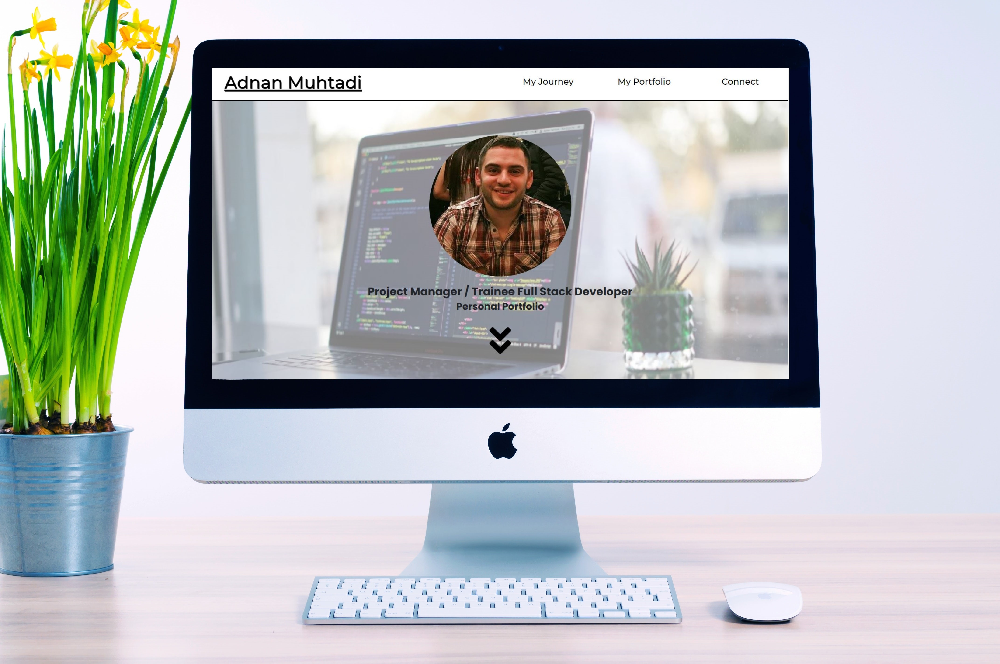

<h1 align="center">Milestone Project 1 - Adnan Muhtadi Personal Portfolio </h1>

[View project here](https://adnanmuhtadi.github.io/milestone-project-1/)

This is my personal portfolio site where I would be able to advertise my skills and other web projects that I have developed. It will also be a placeholder where I would advertise myself, my skills, employment history projects as well as a method of contacting me. This project would utilise the skills that I have learnt from this course to achieve this project.

The content of this site would be used throughout my journey as my skills and projects would forever keep developing. This site would consist of various technologies such as HTML5, CSS3 as well as bootstrap (further technologies would be utilised as my skills develop throughout my career in development). This site will be responsive which would make it accessible on all size devices.

<h2 align="center"></h2>

## User Experience (UX)

### The Audience

The purpose of this site is to advertise me in forms of work experiences, education, hobbies and interests. The intended audience will be future employers as well as job recruiters.

### User Objectives

The website will inform users (Recruiters, Employers, Business and Independent Contracts) who I am and my skills that will be demonstrated in multiple ways. Having a skills bar as well as the site is a placeholder for the other websites which I have developed. (In the short run, the sites which will be used as placeholders will be the sites that were developed as exercises during the course).

The user would also be able to know my journey to know where and how I started my education and career. They would also have the opportunity to view and download my CV as that would inform them more about me. The user would also be able to reach out and contact me in multiple ways in forms of social media and/or a contact form.

### My Objectives

My project is going to achieve its objectives by having snippets of information extracted from my personal CV (which would also be accessible via the website). The website will provide the user with a method of viewing and downloading a PDF copy of my CV. Another section would incorporate multiple box models in a form of thumbnails to advertise the other projects which I have developed using Code Institute tutorials.

I aim to keep it simple and elegant with a soft colour scheme as I do not want to distract the user from the main purpose of the website. If the user wants to reach out to me, social media options would be placed in the footer within every page. Another method of contacting me would be through the contact form which would be the last page of the website.

### User Stories

The intended type of users which this website is targeted for are Recruiters, Employers, Businesses and Independent Contractors.

1. As a user, I want to be able to identify the different webpages within the website so I can clearly choose which webpage I want to go on.
2. As a user, I want to be able to view/download the developers' CV so I can find out more information about the developers.
3. As a user, I want to be able to contact the developer so I can ask questions if I want to reach out to him.
4. As a user, I want to find social media links so I can follow their activity.
5. As a user, I want to see the developers portfolio so I can see what other sites they have developed.
6. As a user, I want to see the developers skillsets so I know what his main skills are.

### Design
-   #### Colour Scheme
    -   I kept the colour scheme White with a little shade of grey in different parts of the site as I wanted to keep the site simple and friendly to the eye

-   #### Typography
    -   I have chosen to use Poppins and Montserrat font as the main fonts throughout the website with Sans Serif as the emergency font in the case for any reason the font is not being imported into the site correctly. Both Poppins and Montserrat is a clean font and easy to read, so it is both attractive and appropriate.

-   #### Imagery
    -   The images that were used are based on the content of what it is portraying. Each hero image has the reduced opacity to increase the visibility of any content which would be on the images.

*   ### Wireframes

    #### Home Page
    -   Home Page Wireframe (Web) - [View](https://github.com/adnanmuhtadi/milestone-project-1/blob/master/documentation/wireframes/home-wireframe-laptop.pdf)
    -   Home Page Wireframe (Tablet) - [View](https://github.com/adnanmuhtadi/milestone-project-1/blob/master/documentation/wireframes/home-wireframe-tablet.pdf)
    -   Home Page Wireframe (Mobile) - [View](https://github.com/adnanmuhtadi/milestone-project-1/blob/master/documentation/wireframes/home-wireframe-mobile.pdf)

    #### Journey Page
    -   My Journey Wireframe (Web) - [View](https://github.com/adnanmuhtadi/milestone-project-1/blob/master/documentation/wireframes/journey-wireframe-laptop.pdf)
    -   My Journey Wireframe (Tablet) - [View](https://github.com/adnanmuhtadi/milestone-project-1/blob/master/documentation/wireframes/journey-wireframe-tablet.pdf)
    -   My Journey Wireframe (Mobile) - [View](https://github.com/adnanmuhtadi/milestone-project-1/blob/master/documentation/wireframes/journey-wireframe-mobile.pdf)

    #### Portfolio Page
    -   Portfolio Wireframe (Web) - [View](https://github.com/adnanmuhtadi/milestone-project-1/blob/master/documentation/wireframes/portfolio-wireframe-laptop.pdf)
    -   Portfolio Wireframe (Tablet) - [View](https://github.com/adnanmuhtadi/milestone-project-1/blob/master/documentation/wireframes/portfolio-wireframe-tablet.pdf)
    -   Portfolio Wireframe (Mobile) - [View](https://github.com/adnanmuhtadi/milestone-project-1/blob/master/documentation/wireframes/portfolio-wireframe-mobile.pdf)

    #### Connect Page
    -   Connect Wireframe (Web) - [View](https://github.com/adnanmuhtadi/milestone-project-1/blob/master/documentation/wireframes/connect-wireframe-laptop.pdf)
    -   Connect Wireframe (Tablet) - [View](https://github.com/adnanmuhtadi/milestone-project-1/blob/master/documentation/wireframes/connect-wireframe-tablet.pdf)
    -   Connect Wireframe (Mobile) - [View](https://github.com/adnanmuhtadi/milestone-project-1/blob/master/documentation/wireframes/connect-wireframe-mobile.pdf)

    - Master Wireframes - [View](https://github.com/adnanmuhtadi/milestone-project-1/blob/master/documentation/wireframes/milestone-1-master-wireframes.bmpr)

## Features

The features that will be utilised in this project will be as follows:

### Existing Features

#### Site Features

-   Responsive on devices sized 1024px, 768px, 425px, 375px and 320px.
-   Allows the user to know the navigated hyperlinks, by having hoover over feature within the hyperlinks.

#### Navigation bar

-   All links within the navigation bar would take the user to its representable page.
-   The layout of them would change on a mobile device.
-   Active pages would be visible as the links would be in bold and underlined.
-   All link on the navigation bar has a hover-over effect.

#### Footer

-   Quick links would take you different pages of the website.
-   Clickable social media icons which are connected to my personal social media homepages.
-   Allows the user to download my CV, by having the developers CV to be viewed and downloaded in a PDF format.

#### Header Image

-   Have the header image expand the full width and height of the display on larger screens, but would change depending on the size of the device.
-   On a large screen, Allow user to click on the arrows pointing down on the jumbotron image to see the next content.

#### About Me

-   Would display information about me and my interests in a user friendly and clear view without displaying too much white space.
-   On mobile view, the format of the page would change but the content would remain the same.

#### Journey

-   Allow user to see my skills sets and confidence level of each one.
-   In a responsive view, the skills would disappear and show my journey only.
-   Allow user to go through my journey from birth to where I am today.
-   Allow user to download my CV, by having my CV to be viewed and downloaded in a PDF format.

#### Portfolio

-   Will display the other websites which have been developed (these are the projects developed while doing the course).

#### Connect

-   Allows the user to know the areas of text entry, by having the text box highlighted when selected

### Features Left to Implement

-   Allow the developer to amend the website via a CMS to update the website quicker.
-   Allowing the contact form to send an email to my email address.
-   Placeholder on the website with personal information to be able to reach out easier.
-   To make the hover-over features more animated.
-   To make the navigation bar collapsable on smaller devices.

## Technologies Used

###  Programming Languages Used

-   [HTML5](https://en.wikipedia.org/wiki/HTML5)
    - HTML5 was used to structure and present content on my website.
-   [CSS3](https://en.wikipedia.org/wiki/Cascading_Style_Sheets)
    - CSS3 was used to provide my website with style

### Frameworks, Libraries & Programs Used

1. [Google Chrome:](https://www.google.co.uk/intl/en_uk/chrome/)
    - Default browser used to visually display the build process as well as utilising Chrome Dev Tools to assist where needed.
1. [Paint 3D:](https://www.microsoft.com/en-gb/p/paint-3d/9nblggh5fv99?activetab=pivot:overviewtab)
    - Was used to crop images to be the same size throughout
1. [Bootstrap 4.5.2:](https://getbootstrap.com/docs/4.4/getting-started/introduction/)
    - Bootstrap was used to assist with the responsiveness and styling of the website.
1. [Google Fonts:](https://fonts.google.com/)
    - Google fonts were used to import the 'Titillium Web' font into the style.css file which is used on all pages throughout the project.
1. [Font Awesome:](https://fontawesome.com/)
    - Font Awesome was used on all pages throughout the website to add icons for aesthetic and UX purposes.
1. [Git:](https://git-scm.com/)
    - Git was used for version control by utilizing the Gitpod terminal to commit to Git and push to GitHub.
1. [GitHub:](https://github.com/)
    - GitHub is used to store the code of the project after being pushed from Git.
1. [Github Desktop:](https://desktop.github.com/)
    - A tool that allows you to interact with Github from the desktop
1. [Balsamiq:](https://balsamiq.com/)
    - Balsamiq was used to create the [wireframes](https://github.com/adnanmuhtadi/milestone-project-1/tree/master/documentation/wireframes) during the design process.
1. [Brackets:](http://brackets.io/)
    - Brackets was used as my text editor to develop the site.
1. [Grammerly:](https://app.grammarly.com/)
    - Online tool which assists with the english grammar.

## Testing

Testing was taken place during my build of the site. I was utilising Brackets plugin 'Live Preview' to visually see what my website looks like with every change that is made. I was also utilising Chrome Dev Tools to assist with changes when code was not working as planned. Within Chrome Dev Tools, I was also utilising the responsive views to see the development for the responsive sizes.

In this section, I would be testing the User Stories taken from the User Experience Section (UX), testing the functionality and usability, testing the responsive views as well as browser testing.

### Validation

On code completion, i ensured my code was validated with no snytax errors. I used [W3C Markup Validator](https://validator.w3.org/) for HTML5 and [W3C CSS Validator](https://jigsaw.w3.org/css-validator/) for CSS3 to ensure my code is W3C Compliant.

#### Results

Page | Initial Errors | Resolved Errors | Error Notes
------------ | ------------- | ------------- | -------------
index.html| [Initial Errors](https://github.com/adnanmuhtadi/milestone-project-1/blob/master/documentation/validaiton/with-errors/validation-results-adnanmuhtadi.github.io_milestone-project-1_index.html.pdf) | [Resolved Errors](https://github.com/adnanmuhtadi/milestone-project-1/blob/master/documentation/validaiton/without-errors/validation-results-adnanmuhtadi.github.io_milestone-project-1_index.html.pdf) | H1 element to to be used as top-level heading only.
journey.html| [Initial Errors](https://github.com/adnanmuhtadi/milestone-project-1/blob/master/documentation/validaiton/with-errors/validation-results-adnanmuhtadi.github.io_milestone-project-1_journey.html.pdf) | [Resolved Errors](https://github.com/adnanmuhtadi/milestone-project-1/blob/master/documentation/validaiton/without-errors/validation-results-adnanmuhtadi.github.io_milestone-project-1_journey.html.pdf) | Attribute Joruney-dates not allowed on element div. The value of the 'for' attribute of the 'label' element must be the ID of a non-hidden form control.
portfolio.html| [Initial Errors](https://github.com/adnanmuhtadi/milestone-project-1/blob/master/documentation/validaiton/with-errors/validation-results-adnanmuhtadi.github.io_milestone-project-1_portfolio.html.pdf) | [Resolved Errors](https://github.com/adnanmuhtadi/milestone-project-1/blob/master/documentation/validaiton/without-errors/validation-results-adnanmuhtadi.github.io_milestone-project-1_portfolio.html.pdf) | Bad value 'button' for attribute 'type' on element 'a': Subtype missing. Attribute 'value' not allowed on element 'a' as well as 'button'.
connect.html| [Initial Errors](https://github.com/adnanmuhtadi/milestone-project-1/blob/master/documentation/validaiton/with-errors/validation-results-adnanmuhtadi.github.io_milestone-project-1_connect.html.pdf) | [Resolved Errors](https://github.com/adnanmuhtadi/milestone-project-1/blob/master/documentation/validaiton/without-errors/validation-results-adnanmuhtadi.github.io_milestone-project-1_connect.html.pdf) | H1 element to to be used as top-level heading only.
style.css | No Errors Found | [Resolved Errors](https://github.com/adnanmuhtadi/milestone-project-1/blob/master/documentation/validaiton/without-errors/css-validator-results-adnanmuhtadi.github.io_milestone-project-1_assets_css_style.css.pdf) | The value of the 'for'attribute for the 'label' element must be the ID for a non-hidden form control.

### Further Testing

#### User Stories Testing from User Experience (UX) Section - [View Results](https://github.com/adnanmuhtadi/milestone-project-1/blob/master/documentation/testing-md-docs/user-testing-uk.md)

When carrying out the User Stories Testing, I placed my self as the user being provided instructions on how to achieve the goals that were identified. The intended type of users which this website is targeted for are Recruiters, Employers, Businesses and Independent Contractors. I displayed screenshots with the results of each finding to provide evidence of the stories being achieved successfully.

#### Functionality and Usability Testing - [View Results](https://github.com/adnanmuhtadi/milestone-project-1/blob/master/documentation/testing-md-docs/features-function-testing.md)

Testing all my functions and features within the site and ensuring that it is usable across different browsers and devices. I laid the results out in a table with each section defining the feature/function, a description of what I am testing as well as if it passes or fails.

#### Browser and Responsive Testing

All tests which have been mentioned in the link above has been tested on the following browsers: Chrome, Edge, Firefox and Safari. All features and functions worked as expected, including the addition of UX designs (excpet for the known issues mentioned below). The site was also tested on different size devices which consisted of a desktop 22inch, a laptop, a tablet as well as a mobile phone.

### Known Issues

- On the home page, on a larger screen, I could not get the pointing down arrows icon to align with the other pages.
- The contact form within the connect page, is not currently connected to a mail server to send emails.

## Deployment

The project was deployed to Github Pages using the following method:

1.  Log into Github and found the [Project Repository](https://github.com/adnanmuhtadi/milestone-project-1)
1.  At the top of the Repository, i clicked the "[Settings](https://github.com/adnanmuhtadi/milestone-project-1/settings)" option on the menu.
1.  I scrolled down the page until i found "Github Pages" section.
1.  Under the "Source" section, a drop-down option with the result of "None" is visible. I clicked on the drop-down option and selected "Master Brand".
1.  The page would automatically refresh itself to the top of the page.
1.  I scrolled down to 'Github Pages' again and found a published link which is my deployed site URL.

### Making a Clone

To make a clone, I had to get the SSH key from the repository which allowed me to clone the repository to my local hard drive.

#### Method 1: Github Desktop

The alternative method which I used when I first started the project was [Github Desktop](https://desktop.github.com/). I was able to connect my Github repository and push my files through that method. I eventually stopped as the plugin within my code editor did the same job. This enabled me to have one less application to have running while developing.

#### Method 2: (mostly used)

Within brackets (Editing tool), I was able to download a plugin which enabled me to connect brackets to my GitHub repository. Whenever code was created and saved, I was given the option to commit and make notes on the upload. Once done, I was able to push the changes to GitHub.

## Credits

### Content

The content that was used to build the website from my [CV](https://github.com/adnanmuhtadi/milestone-project-1/blob/master/assets/cv/adnan-muhtadi-cv.pdf) as well as from what has been taught from the Code Instite Lessons and [W3C](https://www.w3schools.com/).

### Code

Most of the code that was used was taken from the Code Institue lessons, however, I utilised other sources for some areas of the site

- Utilised all over the site
    - [Enlarging the background](https://stackoverflow.com/questions/4216035/css-background-image-alt-attribute) to be the size of the browser window for large screens
    - [Link within the page](http://www.echoecho.com/htmllinks08.htm)
    - [Grid element](https://getbootstrap.com/docs/4.5/layout/grid/) to manage the layout of the site
- My Journey Page
    - [Progress bars](https://getbootstrap.com/docs/4.5/components/progress/) for the skills
    - Icons used within the [timeline](https://css-tricks.com/working-with-shapes-in-web-design/)
- Portfolio Page
    - [Card container](https://getbootstrap.com/docs/4.5/components/card/)
    - [Card container](https://www.w3schools.com/howto/howto_css_cards.asp)
- README.md
    - Assist with the styling of some areas within the [README.md](https://guides.github.com/features/mastering-markdown/)
    - [Icons](https://stackoverflow.com/questions/47344571/how-to-draw-checkbox-or-tick-mark-in-github-markdown-table) used within the README file

### Media

The main source for the images i have used is from [Unsplash](https://unsplash.com/):

- Home Page
    - [Header image](https://unsplash.com/photos/vpOeXr5wmR4)
    - Profile picture - taken while i was on holiday.
    - [About me](https://unsplash.com/photos/GDLdU80UDko)
    - Interests
        - [Travelling](https://unsplash.com/photos/Y_LWT7HbpQc)
        - [Programming](https://unsplash.com/photos/iacpoKgpBAM)
        - [Fitness](https://unsplash.com/photos/Cv7rucR1bhQ)
        - [Cooking](https://unsplash.com/photos/qeWlYA2G_n4)
- My Journey
    - [Header image](https://unsplash.com/photos/IuLgi9PWETU)
- My Portfolio
    - [Header image](https://unsplash.com/photos/b21Ty33CqVs)
    - Other images where taken from as a screenshot from the front page of exisiting sites
- Connect
    - [Header image](https://unsplash.com/photos/oIpJ8koLx_s)
    - [Form structure](https://www.w3schools.com/html/html_forms.asp)
-README.md
    - [Image to display](https://unsplash.com/photos/ir5lIkVFqC4) my site on the computer

- The icons used throughout the site were taken from [Font Awesome](https://fontawesome.com/)
    - [Poppins](https://fonts.google.com/specimen/Poppins?preview.text_type=custom&sidebar.open=true&selection.family=Poppins:ital,wght@1,600)
    - [Montserrat](https://fonts.google.com/specimen/Montserrat?preview.text=Adnan%20Muhtadi&preview.text_type=custom&sidebar.open=true&selection.family=Baloo+Tammudu+2:wght@500)

### Acknowledgements

I want to thank my mentor Aaron Sinnott who guided me in the right direction and with his support. This project has opened my eyes to so many helpful tools as well as the resources that are available online such, W3C school as well as stack overflow.

The idea for the website came from one of the projects that we did during the Code Institute lessons, Rosie Resume. It had the right concept behind it, but I wanted to advertise not just myself, but the projects that I would be creating in the future.
