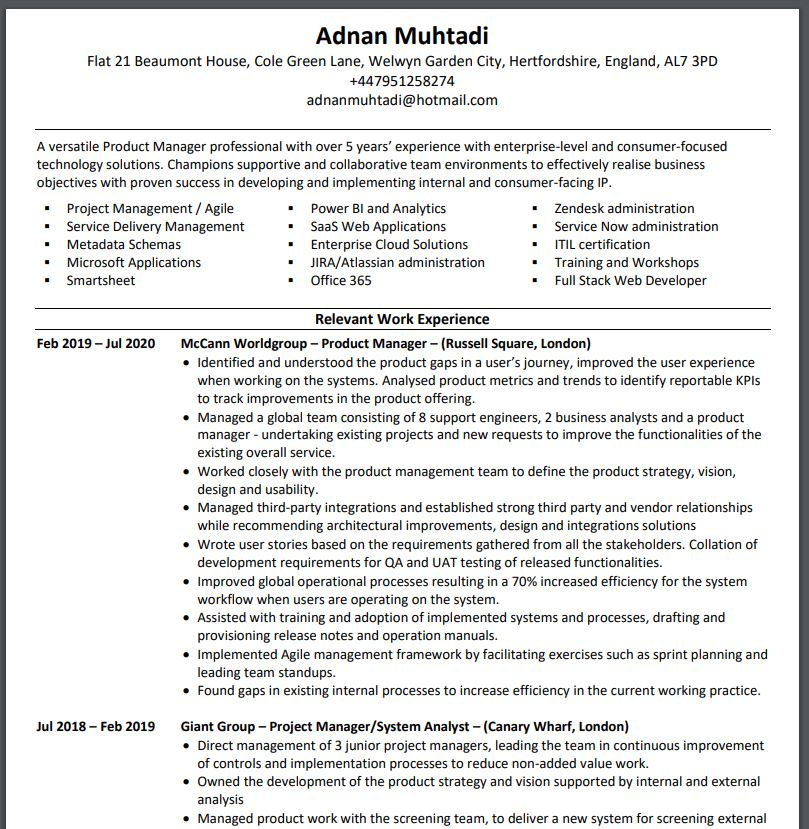
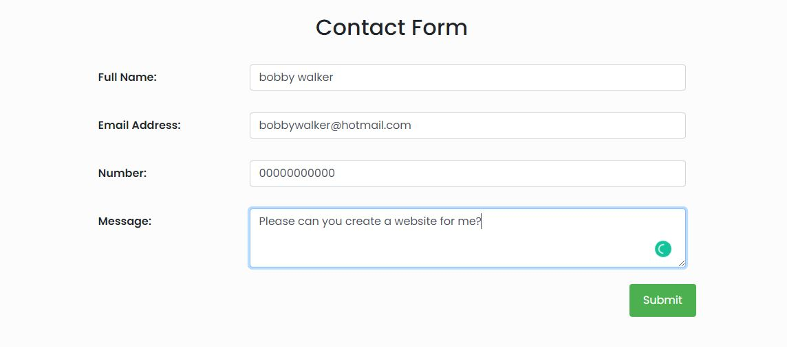

-  As a user, I want to be able to identify the different webpages within the website so I can clearly choose which webpage I want to go on.
    1.  Upon entering the site, I would able to see a navigation bar on the top of the page with my name in bold and underlined
    1.  Using the mouse, hover over the other webpages 'My Journey', 'My Portfolio' and 'Connect'.
    1.  I would be able to see the webpages that I can enter as it would also be in bold and underlined.

-   As a user, I want to be able to view/download the developers' CV so I can find out more information about the developers.

    -   #### Method One - My Journey
        1.  Upon entering the site, click on the 'My Journey' page.
        1.  Once the webpage has loaded, scroll down to the bottom of the page.
        1.  I would see a 'CLICK HERE' link within the last section of the page.
        1.  When clicked, this would take me to another tab where I would be able to see the developers CV in a PDF format and/or download.

    -   #### Method Two - Footer
        1.  Upon entering the site, scroll to the bottom of the webpage.
        1.  A footer is visible to me.
        1.  I would be able to see the file icon under 'Take a copy of my CV!'
        1.  When clicked, this would take me to another tab where I would be able to see the developers CV in a PDF format and/or download.

- As a user, I want to be able to contact the developer so I can ask questions if I want to reach out to him.
    1.  Upon entering the site, click on the 'Connect' page.
    1.  Once the webpage has loaded, scroll down to the 'Contact Form' part of the page.
    1.  Enter information to fill the form.
    1.  When click on submit, the form will not work as the link is not connected (future development).

- As a user, I want to find social media links so I can follow their activity.
    1.  Upon entering the site, scroll down to the bottom of the webpage.
    1.  A footer is visible to me.
    1.  I would be able to see the social media icons under 'Lets Connect'.

- As a user, I want to see the developers portfolio so I can see what other sites they have developed.
    1.  Upon entering the site, click on the 'My Portfolio' page.
    1.  Once the webpage has loaded, scroll down to the 4 thumbnails which have an image of the webpage as well as a small description under each image.
    1.  Click on the 'Visit Me!' button within a thumbnail
    1.  A New tab would open with the site that was made.

- As a user, I want to see the developers skillsets so I know what his main skills are.
    1.  Upon entering the site, click on the 'My Journey' page.
    1.  Once the webpage has loaded, scroll down to see progress bars which are ratings of the developers' skills.

[Return to main README.md](https://github.com/adnanmuhtadi/milestone-project-1/blob/master/README.md)
